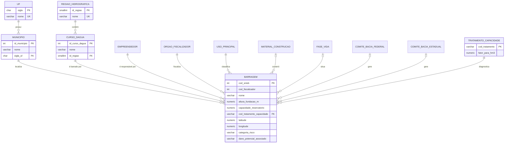

# Barragens de Usinas Hidrelétricas (ANA / SNISB) — Banco de Dados PostgreSQL

Banco relacional normalizado até a **3ª Forma Normal**, construído a partir do arquivo
`ana_barragens_hidreletricas.csv` (887 barragens × 33 colunas, extraído do SNISB/ANA).
Todos os dados da planilha são carregados, e a planilha original pode ser reconstruída
a partir do banco (validação automática com 0 diferenças).

**Equipe**

| Nome |


| Eduardo Aragao Rodrigues 
| Douglas Mauricio Daibes 
| Marcos Costa 


---

## 1. Estrutura da entrega

```
projeto_barragens_ana/
├── README.md                          ← este arquivo
├── sql/
│   ├── 01_ddl.sql                     ← ENTREGA 1: criação de tabelas, chaves, restrições, índices e visões
│   ├── 02_carga.sql                   ← ENTREGA 2: carga completa (INSERT) a partir do zero
│   ├── 03_validacao.sql               ← prova de que nenhuma informação foi perdida (opcional)
│   └── 04_consultas_apresentacao.sql  ← 25 consultas de treino para a apresentação
├── scripts/
│   └── gerar_carga.py                 ← apoio: gera o 02_carga.sql a partir do CSV
└── dados/
    └── ana_barragens_hidreletricas.csv
```

## 2. Como executar

Em um banco **vazio**, rodar os scripts em sequência:

```bash
createdb barragens
psql -d barragens -v ON_ERROR_STOP=1 -f sql/01_ddl.sql
psql -d barragens -v ON_ERROR_STOP=1 -f sql/02_carga.sql
psql -d barragens -f sql/03_validacao.sql          # opcional
```

No pgAdmin / DBeaver: abrir cada arquivo no Query Tool e executar (F5) na ordem 01 → 02 → 03.
O `02_carga.sql` é autocontido (os dados estão dentro dele como `INSERT`); não precisa do CSV
nem de caminho de arquivo, e roda dentro de uma única transação.

Testado em PostgreSQL 16 (compatível com 13+). Resultado da carga:

| Tabela | Linhas |
|---|---:|
| barragem | 887 |
| empreendedor | 406 |
| municipio | 448 |
| curso_dagua | 348 |
| comite_bacia_estadual | 118 |
| uf | 27 |
| comite_bacia_federal | 19 |
| regiao_hidrografica | 11 |
| material_construcao | 8 |
| fase_vida | 5 |
| tratamento_capacidade | 5 |
| orgao_fiscalizador | 1 |
| uso_principal | 1 |

Para regenerar o script de carga a partir do CSV: `python3 scripts/gerar_carga.py`.

## 3. Modelo de dados



**Hierarquias:** `barragem → município → UF` (político-administrativa) e
`barragem → curso d'água → região hidrográfica` (hidrográfica). Comitês de bacia ficam
ligados diretamente à barragem porque os dados mostram que não dependem do rio, do trecho
nem do município.

**Visões:**
- `vw_barragem` — barragem com tudo resolvido + atributos derivados (`tipo_usina`,
  `capacidade_hm3`, `unidade_gestao`). Ideal para consultas rápidas.
- `vw_barragem_csv` — reconstrói as 33 colunas da planilha, com os mesmos nomes e ordem.

## 4. Decisões de modelagem (resumo)

### 4.1 Dependências analisadas

Cada dependência foi testada nos dados antes de decidir onde o atributo fica:

| Dependência testada | Resultado nos dados | Decisão |
|---|---|---|
| `municipio → uf` | **Falha**: 5 nomes em 2 UFs (ex.: GUARACIABA SC/MG) | Município com chave natural `(nome, UF)` |
| `(municipio, uf) → regiao_hidrografica` | **Falha**: 3 municípios em 2 regiões | Região **não** fica no município |
| `curso_dagua → regiao_hidrografica` | **Falha**: 22 nomes homônimos (ex.: "Rio Grande") | Curso d'água com chave `(nome, região)`; a região sai da barragem |
| `(curso, região) → dominio_curso_dagua` | **Falha**: 27 rios com domínio vazio numa linha e "Federal" em outra | Domínio fica na barragem (dado do trecho no cadastro) |
| `cod_trecho_curso_dagua → curso_dagua` | **Falha**: 25 códigos com rios diferentes | Código do trecho fica na barragem |
| `comite_estadual → comite_federal` | **Falha**: 19 violações | Comitês independentes, duas FKs opcionais |
| `(comite_federal, comite_estadual) → unidade_gestao` | **Válida em 887/887**: `unidade_gestao = COALESCE(federal, estadual)` | **Não armazenada** (seria dependência transitiva); recalculada na visão |
| `numero_autorizacao → data_autorizacao` | **Falha**: 66 números com datas diferentes ("007" em 23 barragens) | Autorização fica na barragem (não é entidade identificável) |
| `cod_snisb → todas` / `cod_fiscalizador` único | Válidas | `cod_snisb` = PK; `(órgão, cod_fiscalizador)` = UNIQUE |

### 4.2 Colunas constantes

| Coluna | Valor único | Decisão | Justificativa |
|---|---|---|---|
| `orgao_fiscalizador` | ANEEL | **Tabela** | É entidade real; o SNISB tem outros fiscalizadores e o `cod_fiscalizador` só é único dentro do órgão |
| `uso_principal` | Hidroelétrica | **Tabela (domínio)** | Domínio aberto no SNISB (irrigação, abastecimento…); o modelo aceita outros recortes sem mudar o DDL |
| `regulada_pnsb` | true | **Coluna mantida** | Atributo individual de cada barragem; constante só por causa do recorte |
| `barragem_autuada` | false | **Coluna mantida** | Situação que muda por barragem ao longo do tempo |
| `completude_cadastro` | boa | **Coluna mantida** | Avaliação individual de cada cadastro |

Transformar as três últimas em "constante" (apagar a coluna) perderia informação da planilha;
transformá-las em tabela criaria tabelas com 1 linha sem ganho de integridade.

### 4.3 Capacidade do reservatório (inconsistência de unidade)

A unidade oficial é **hm³** (milhões de m³). O maior reservatório do Brasil (Serra da Mesa)
tem cerca de 54.400 hm³, mas a fonte traz valores como **12.619.790.000** (UHE São Simão).
Tratamento adotado:

1. O valor da fonte é guardado **sem alteração** em `barragem.capacidade_reservatorio` (sem perda).
2. Cada barragem recebe um diagnóstico (`cod_tratamento_capacidade`, FK para `tratamento_capacidade`).
3. A capacidade corrigida é **derivada** na visão: `capacidade_hm3 = valor × fator_para_hm3`.

| Código | Regra | Fator | Barragens |
|---|---|---|---:|
| CONSISTENTE | valor plausível em hm³ | 1 | 871 |
| CONVERTIDO_M3 | valor ≥ 1.000.000 → estava em m³ | 0,000001 | 11 |
| CONVERTIDO_MIL_M3 | 60.000 < valor < 1.000.000 → estava em mil m³ (UHE Itupararanga: 224.800 → 224,8 hm³) | 0,001 | 3 |
| SUSPEITO | PCH/CGH com mais de 1.000 hm³ (CGH Itaubá: 4.000) — sem conversão segura | NULL | 1 |
| ZERO | capacidade 0 → tratada como não informada | NULL | 1 |

Observação: diques de uma mesma usina repetem a capacidade do reservatório (ex.: 33 estruturas de
Belo Monte com 4.508 hm³). Somar capacidade por região superestima o volume real.

### 4.4 Outras decisões

- **Vazio ≠ "Sem Informação"**: em `tipo_material`, 188 linhas vazias viram `NULL` e 26 linhas
  "Sem Informação" viram um valor do domínio. As duas situações continuam distinguíveis.
- **Municípios com grafia duplicada**: 5 municípios aparecem em caixa alta e baixa
  (ex.: LONDRINA / Londrina, PR). São a mesma entidade: uma linha, em caixa alta. Um índice
  único em `(upper(nome), sigla_uf)` impede a duplicação.
- **Nome da barragem** mantido atômico: o padrão "USINA - ESTRUTURA" não é confiável
  (35 nomes fogem dele). O tipo de usina (UHE/PCH/CGH) é derivado na visão.
- **"SEM NOME"** em curso d'água é mantido como na fonte.
- **`data_autorizacao = 2000-01-01`** (211 linhas) parece data genérica da fonte; mantida e documentada.
- **Categoria de risco e dano potencial** usam `CHECK IN ('Baixo','Médio','Alto')`: domínio fechado
  definido pela Lei 12.334/2010.
- **Lat/long** com `CHECK` no envelope do território brasileiro.

## 5. Como os dados foram carregados

1. `scripts/gerar_carga.py` converte cada linha do CSV em um `INSERT` na tabela
   `staging.csv_barragens` (texto puro, sem transformação).
2. Dentro do `02_carga.sql`, em SQL puro: `SELECT DISTINCT` popula cada tabela de referência;
   `INSERT … SELECT` com `JOIN` popula `barragem`, convertendo tipos (`NULLIF(x,'')`, `::date`,
   `::boolean`, `::numeric`) e aplicando a regra da capacidade.
3. Um bloco `DO` confere as 887 linhas e a reconstrução de `unidade_gestao`; se falhar, a
   transação inteira é desfeita.
4. `03_validacao.sql` compara a planilha reconstruída (`vw_barragem_csv`) com o CSV original
   usando `EXCEPT ALL` nos dois sentidos → **0 diferenças**.

O schema `staging` fica no banco para auditoria. Para removê-lo: `DROP SCHEMA staging CASCADE;`

## 6. Consultas para a apresentação

`sql/04_consultas_apresentacao.sql` traz 25 consultas comentadas (contagens por UF/região,
risco × dano, barragens sem PAE, top empreendedores, window functions, subconsultas etc.).
Dica: a coluna `possui_pae` tem 208 valores `NULL`; use `IS NULL` / `IS DISTINCT FROM` quando a
pergunta envolver "não possui PAE".
